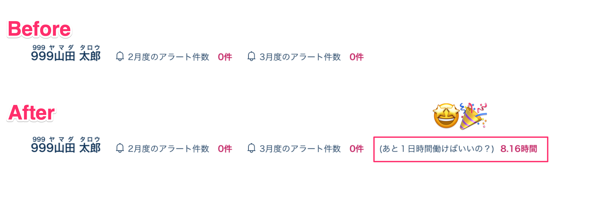

# Super Cool Akashi Extension

## これは何？
勤怠管理システムAKASHIをちょっとだけ便利にするChrome拡張です。

↑のように **月末までに1日あたり何時間働けば所定労働時間を満たすか** を表示します。

## インストール方法

まだChrome拡張ストアに出してないので以下の手順でインストールできます。

1. このリポジトリをcloneする（もしくはファイルを単にダウンロードする）
1. Chrome拡張機能の設定ページ(`chrome://extensions/`)にアクセスし、左上の「パッケージ化されていない拡張機能を読み込む」をクリックする
1. clone（もしくはダウンロード）した本リポジトリのフォルダを選択する
